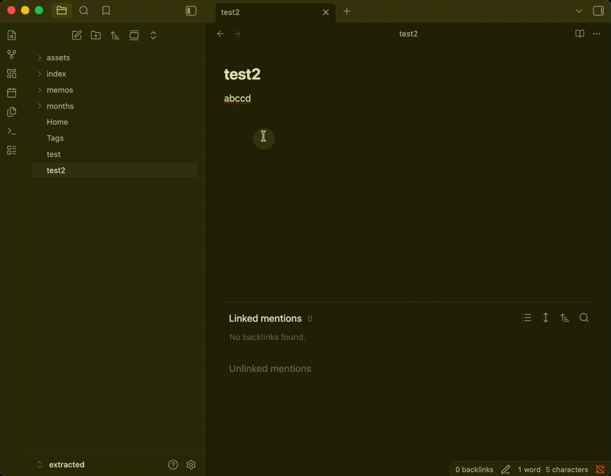

# content-mention

[English](./README.md) | [MIT 许可证](./LICENSE) | [手动测试计划](./MANUAL-TEST-PLAN.md)

`content-mention` 是一个给 Obsidian 用的社区插件，核心目标是把 `@mention` 变成“按内容找笔记”的写作入口。

你在写笔记时，如果只记得某个词、某句话，或者一段中文内容出现在以前的某篇笔记正文里，但不记得文件名，就可以直接输入 `@词组`。插件会在 Markdown 正文里查找匹配内容，给出候选结果，并把选中的结果插回当前编辑器。



## 功能说明

- 在 Markdown 编辑器里输入触发字符，再继续输入至少 1 个字符后，弹出行内建议列表
- 搜索重点是笔记正文内容，同时兼顾文件 basename 匹配
- v1 默认使用不区分大小写的子串匹配，英文和中文都可以直接工作
- 最多显示 10 条结果，每条结果包含 basename、相对路径、命中行预览
- 选中后默认插入 `[[basename]]`，如果目标笔记名看起来像 Untitled，则插入 `[[原始查询词]]`
- 使用轻量级内存缓存，并在创建、修改、删除、重命名时刷新

## v1 排序规则

- basename 完全匹配优先级最高
- basename 前缀匹配和 basename 子串匹配，高于只命中正文的结果
- 正文里越靠近行首的命中，排序越高
- 路径更短的结果略微占优
- 文件修改时间只作为弱 tie-breaker

## Quick Start

### 面向普通使用者

#### 从 release 文件安装

1. 下载最新 release。
2. 在你的 vault 里创建这个目录：

   ```text
   <你的-vault>/.obsidian/plugins/content-mention/
   ```

3. 把下面三个文件放进去：

   ```text
   main.js
   manifest.json
   versions.json
   ```

4. 打开 Obsidian，进入 `设置 -> 第三方插件`，必要时刷新插件列表，然后启用 `content-mention`。
5. 如果需要，再到插件设置里调整触发字符、结果数量、包含目录和排除目录。

#### 从仓库源码安装

1. 克隆这个仓库。
2. 安装依赖：

   ```bash
   npm install
   ```

3. 构建插件：

   ```bash
   npm run build
   ```

4. 把 `main.js`、`manifest.json`、`versions.json` 复制到：

   ```text
   <你的-vault>/.obsidian/plugins/content-mention/
   ```

5. 回到 Obsidian，启用 `content-mention`。

### 面向人类开发者

这一部分适合想自己改代码、在本地 vault 里调试插件的人。

1. 克隆仓库并安装依赖：

   ```bash
   npm install
   ```

2. 启动监听构建：

   ```bash
   npm run dev
   ```

3. 在测试用 vault 中创建插件目录：

   ```text
   <你的测试-vault>/.obsidian/plugins/content-mention/
   ```

4. 把仓库里构建出来的这三个文件复制过去：

   ```text
   main.js
   manifest.json
   versions.json
   ```

5. 重载 Obsidian 并启用插件。
6. 日常开发时修改 `main.ts` 和 `src/` 下的源码文件。
7. 每次希望 Obsidian 用到最新版本时，把新的 `main.js` 重新复制到 vault 的插件目录。

源码结构：

- `main.ts`：插件入口和生命周期
- `src/suggest/contentMentionSuggest.ts`：行内 `EditorSuggest` 行为
- `src/search/contentIndex.ts`：正文缓存、搜索和排序
- `src/settings.ts`：设置模型和设置页

### 面向 AI 编程代理

如果你用 AI 编程工具继续维护这个仓库，可以直接按下面的约定工作：

1. 先执行 `npm install`。
2. 所有源码修改都在 `main.ts` 和 `src/` 下完成，不要直接编辑 `main.js`。
3. 用 `npm run build` 产出发布包，用 `npm run dev` 做监听构建。
4. 下面三个文件是安装和发布产物：

   ```text
   main.js
   manifest.json
   versions.json
   ```

5. 手动测试前，把这三个产物复制到目标 vault 的插件目录。
6. 只要用户可见行为有变化，同时更新 `README.md` 和 `README.zh-CN.md`。

## 设置项

- `Trigger character`：默认 `@`
- `Max results`：默认 `10`
- `Untitled-like regex patterns`：可编辑的正则列表，默认忽略大小写
- `Include folders`：为空时表示全库搜索
- `Exclude folders`：优先级高于包含目录
- `Case sensitive search`：默认关闭

## v1 的取舍

- 这一版没有做持久化索引，而是维护一个轻量的内存缓存。这样代码更小，可读性更高，也避免每次按键都扫描整个 vault。
- 排序逻辑保持简单，方便检查和调整。它会优先照顾 basename 命中，但不会牺牲正文搜索这个插件的核心能力。
- 插入链接时默认用 `[[basename]]`，所以当 basename 重名时，仍然遵循 Obsidian 自己的 wikilink 解析规则。

## 手动测试

测试清单见 [MANUAL-TEST-PLAN.md](./MANUAL-TEST-PLAN.md)。

## 后续可以做的 v2 方向

- 块级插入，比如 `[[file#heading]]` 或 `[[file#^blockid]]`
- 更聪明的分词，对 camelCase、kebab-case 和中英混合文本更友好
- 更完整的结果预览高亮
- 用修饰键实现“打开结果而不是插入链接”
- 加入最近选择结果的加权
